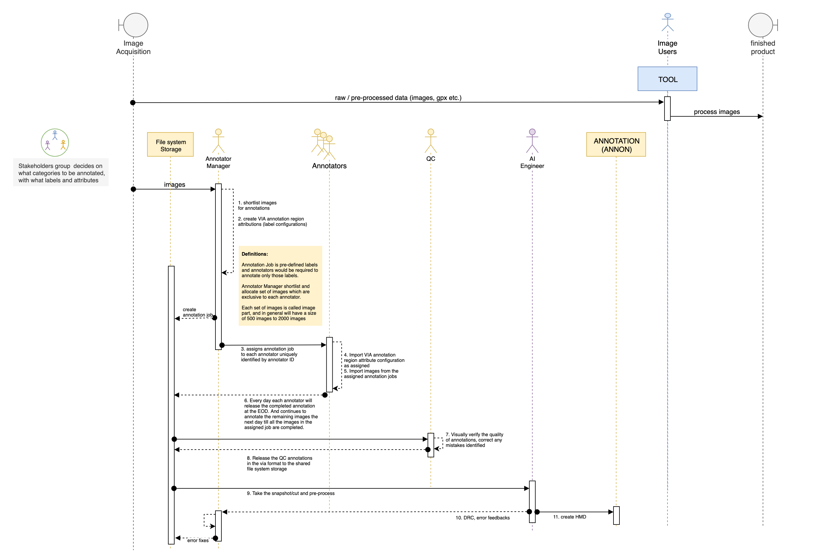
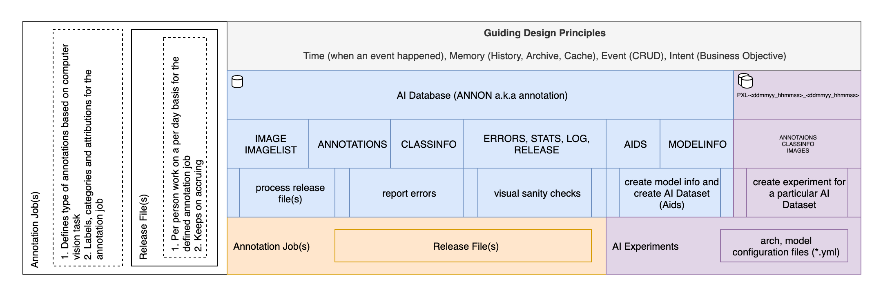
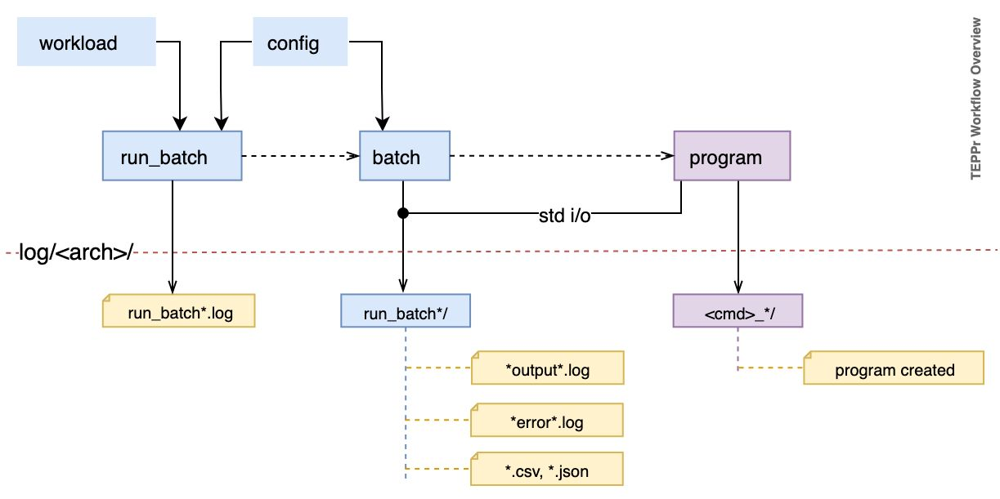

# Annon

Annotation workflow and parser for computer vision tasks.
* annotation data pipeline for consuming into AI training
* Mixing custom annotations with public AI datasets
* Data exploration tools, scripts
* Reporting on annotation data for management


## TODO

* provide sample annotation data and images for running the demo
* **Critical Items**
  * uneven distribution of labels between datasplit
  * different filters for the splot
  * image error to filter out while creating dataset


## Requirements
* MongoDB
* python3
* `pip install -r requirements.txt`


## Multiple Stages

1. **ANNON: Annotation Database**
  * create Annotations to Database
  * `annon_to_db.py`
  * pre-process raw data and performs DRC (Design Rule Checks)
2. **AIDS: AI Datasets**
  * construct AIDS (AI Datasets) from Database
  * `db_to_aids.py`
  * configure control over dataset splits
3. **AIDS to dataset configuration**
  * create the dataset cfg yml file to be used in DNN workflow as the input 
  * `aids_cfg.py`
4. **AIDS to TEPPr**
  * TEPPr: Training, Evaluation Predictin and Publish with reporting


## Configuration files

* `_annoncfg_.py`
  * IMAGE_API
    * STATIC_IMAGE_DIMENSION
    * IMG_CHECK
  * DBCFG
  * AICATS
* `_aidbcfg_.py`
* `_log_.py`


## Annotation Requirements
* **images-part**
  * more than one person can work on annotations of same `images-part` for different computer vision tasks
  * same `images-part` can have different annotations
* **incremental releases**
  * date specific releases, at anytime whenerver it's required
* **release management**
  * Instead of folderwise tracking based on id or person's name every individual provides a unique annotation file for the same or different images-part identified by the annotator-id
  * flat file structures are more flexible for programmatic bindings
  * this also helps in tracking of individual productivity
  * one annotation file contains annotations specific to only one `images-part`
* **QC - Quality Checks**
  * focus on fully-automated, custom splitting of image datasets
  * data exploration scripts and tools
  * statistics on QC


## **Naming Conventions**
* annotations files and image folders are semantically labelled
* annotator manager assigns the annotation job to each annotator such that assigned images to each annotator gets unique image to annotate
* each annotation job defines the fixed type of computer vision task, fixed labels to be annotated
* `ods` stands for object detection and segmentation 
  ```bash
  ├── ods_job_060519
  │   ├── annotations
  │   │   ├── images-p1-030419_AT2_via205_030419.json
  │   │   └── images-p<i>-<ddmmyy>_AT<j>
  │   │   
  │   ├── images
  │   │   ├── images-p1-030419_AT2
  │   │   └── images-p<i>-<ddmmyy>_AT<j>
  │   └── Non_QC_Annotations
  ├
  │
  └── ods_job_<ddmmyy>
       ├── annotations
       └── images
  ```
* Annotation file: `images-p1-030419_AT2_via205_030419.json`
  * refer `parse_annon_filename` in `annonutils.py`
  * Annotation file names are semantically named such that it empowers for different types of annotations in computer vision tasks to be carried out without duplicating the images on the filesystem. And, different annotators can annotate same image for different type of annotation tasks like for detection, classification, scene type, keypoint annoations etc. This also empower for generating different statistics for tracking and management.
  * example: Annotation file is saved with the name: `images-p1-230119_AT1_via205_010219.json`
    * **Level-1:** split with `_` (underscore)
      * returns 4 groups (or Level 2) indexed
      * ex: `[0,1,2,3]` => `['images-p1-230119', 'AT1', 'via205', '010219']`, where:
        * `images-p1-230119` => Reference to `image folder` used for the annotations present in this file
        * `AT1` => Annotator ID
        * `via205` => Annotation tool with version; here VIA annotation tool and version 2.05
        * `010219` => Release date on which the annotation file was provided by the annotator
    * additionally, joining [0,1] back with '_' (underscore) provides the reference for directory under which images are present
      * ex: `[0,1]` => `['images-p1-230119', 'AT1']` joining it back with '_' (underscore) gives: `images-p1-230119_AT1`
    * **Level-2:** For each Level 1 items can be split with `-` (minus) wherever possible (absence of this will not result in error during split)
      * ex: `images-p1-230119` => `['images','p1','230191']`, where:
        * `images` => directory name under which images would be allocated.
        * `p1` => part ID of the images
        * `230191` => date on which the images cut was taken and assigned to the annotators


## Annotation Workflow


**Annotation Event Workflow**


**Data Pipeline Design Overview**


**TEPPr Workflow**



## References 

* [linuxscripts](https://github.com/mangalbhaskar/linuxscripts)
  - system setup and other linux utility scripts
* [technotes](https://github.com/mangalbhaskar/technotes)
  - technology notes on different subject matters 
